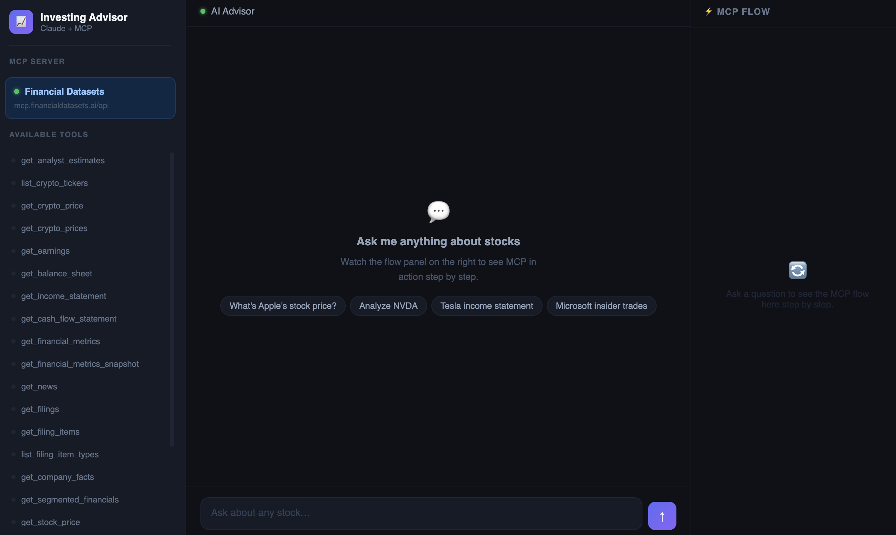
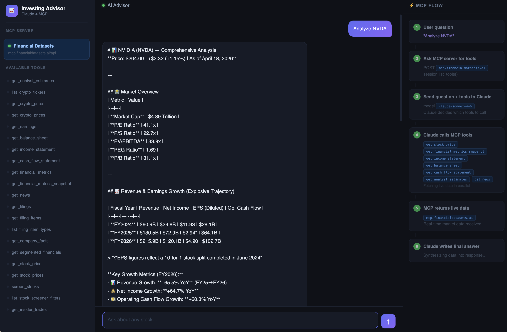

# AI Investing Advisor

An AI-powered investing assistant built with **Claude** and **MCP (Model Context Protocol)**. Ask anything about stocks, crypto, financials, or SEC filings — the AI calls live data tools automatically and shows you exactly which ones it used.

## Screenshots





## How It Works

```
User question
  → Claude decides which tools to call
    → MCP server fetches live data (stocks, crypto, SEC EDGAR)
      → Claude synthesizes a final answer
```

The app connects to the [Financial Datasets](https://financialdatasets.ai) hosted MCP server over HTTPS. Claude discovers and calls these tools dynamically — no tool schemas are hardcoded in the app.

## Setup

1. Install dependencies:
   ```bash
   pip install -r requirements.txt
   ```

2. Create a `.env` file:
   ```
   ANTHROPIC_API_KEY=your_key_here
   FINANCIAL_DATASETS_API_KEY=your_key_here
   ```

3. Run:
   ```bash
   python main.py
   ```

Open http://127.0.0.1:8000

## Available Tools

Provided by the Financial Datasets MCP server (`mcp.financialdatasets.ai/api`):

| Tool | Data |
|------|------|
| `get_stock_price` | Latest stock price snapshot |
| `get_stock_prices` | Historical OHLCV price data |
| `get_income_statement` | Revenue, expenses, net income |
| `get_balance_sheet` | Assets, liabilities, equity |
| `get_cash_flow_statement` | Cash generation and usage |
| `get_financial_metrics` | Historical P/E, revenue growth, etc. |
| `get_financial_metrics_snapshot` | Latest financial ratios snapshot |
| `get_analyst_estimates` | Consensus revenue & earnings estimates |
| `get_earnings` | EPS history from SEC filings |
| `get_filings` | SEC filing list (10-K, 10-Q, 8-K…) |
| `get_filing_items` | Specific sections from SEC filings |
| `list_filing_item_types` | All extractable SEC filing item types |
| `get_company_facts` | Comprehensive company facts from SEC |
| `get_segmented_financials` | Revenue/profit breakdown by segment |
| `get_news` | Recent news articles for a company |
| `get_insider_trades` | Form 4 insider buy/sell activity |
| `screen_stocks` | Filter stocks by financial metrics |
| `list_stock_screener_filters` | All available screener filter fields |
| `get_crypto_price` | Latest cryptocurrency price snapshot |
| `get_crypto_prices` | Historical crypto price data |
| `list_crypto_tickers` | All available crypto ticker symbols |

## Project Structure

```
main.py    — FastAPI app, MCP session lifecycle, routes
agent.py   — Claude agentic loop (tool execution + final answer)
views.py   — UI (three-column chat interface with live MCP flow panel)
```

## Why MCP?

Without MCP, you'd hardcode every tool schema, write dispatch logic for each tool, and manually wire up API calls. With MCP, `session.list_tools()` and `session.call_tool()` handle all of that — the server owns the tools, your app just connects.

## Contributors

- [@jwen0605](https://github.com/jwen0605)
